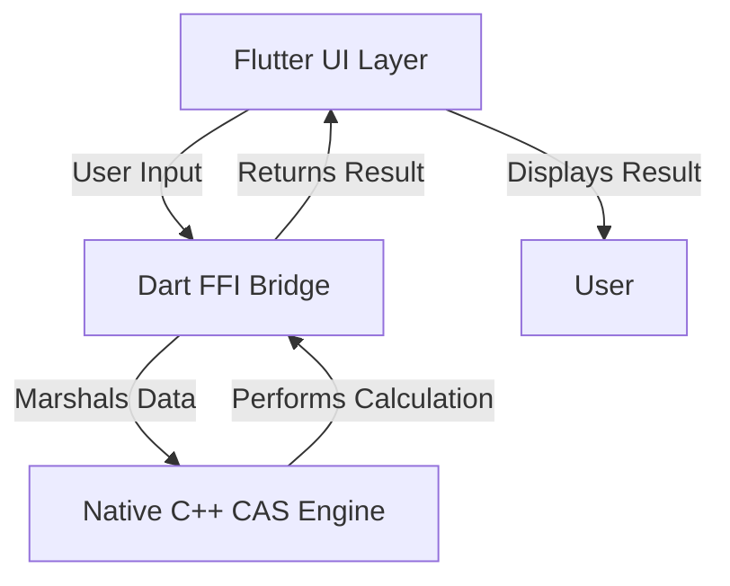

# CrispCalc - CAS Calculator

A cross-platform scientific and graphing calculator built with Flutter. It features a modern, mode-driven user interface and is powered by the SymEngine Computer Algebra System (CAS) for (currently, basic) symbolic mathematics.

Status is: work in progress (see below).

-----

## \#\# Core Features

  * **Advanced Math Display:** Uses LaTeX rendering for a clean, textbook-style display of mathematical expressions.
  * **Symbolic CAS Engine:** Performs high-level algebra and calculus operations, not just numerical calculations.
      * **Equation Solver:** Solves algebraic equations for variables (e.g., `x^2 - 4 = 0`).
      * **Calculus Operations:** Supports symbolic differentiation (`d/dx`) and integration (`∫ dx`).
  * **Interactive Graphing:** A fully interactive 2D function plotter with intuitive pan and pinch-to-zoom gestures.
  * **Mode-Driven UI:** A clean, tabbed interface that separates numeric, scientific, and CAS functions, preventing clutter.
  * **Cross-Platform:** A single codebase for Android, iOS, Windows, macOS, and Linux.

-----

## \#\# Project Architecture

The application is built on a robust three-layer architecture that separates the user interface from the core mathematical logic. This design ensures that the app is both powerful and maintainable.

1.  **Flutter UI (Frontend):** The entire user interface is built in Flutter. It is responsible for rendering the UI, capturing user input, and displaying results. It has no knowledge of how calculations are performed.
2.  **Dart FFI Bridge (Middleware):** This layer connects the Flutter UI to the native C++ engine. It uses Dart's `dart:ffi` library to load the compiled C++ library and define the function signatures that allow Dart and C++ to communicate.
3.  **C++ CAS Engine (Backend):** The "brain" of the calculator. It's a native C++ library that uses **SymEngine** to perform all the heavy-duty symbolic and numerical math. It is completely independent of the UI.

This can be visualized as:



-----

## \#\# File Structure

The project is organized into logical directories for the UI, the engine, and the native source code.

```
CrispCalc/
├── lib/
│   ├── main.dart             # App entry point, BottomNavBar, screen routing
│   ├── screens/
│   │   ├── calculator_screen.dart # Main calculator UI, display, tabbed keypad
│   │   └── graphing_screen.dart # Interactive graphing view with gestures
│   ├── engine/
│   │   ├── calculator_engine.dart # Dart class that abstracts FFI calls
│   │   └── cas_bridge.dart      # Dart FFI bindings to the C++ library
│   └── widgets/
│       ├── keypad_grid.dart       # Reusable grid widget for keypads
│       └── calculator_button.dart # Reusable button widget
│
├── native/                   # C++ source code directory
│   ├── CMakeLists.txt          # Build script for the native library
│   └── cas_wrapper.cpp         # C++ functions exposed to Dart (the C API)
│
├── pubspec.yaml              # Flutter project dependencies
└── README.md                 # This file
```

### File Functions

  * `main.dart`: Initializes the app and sets up the main `Scaffold` with the `BottomNavigationBar` to switch between the different screens (`CalculatorScreen`, `GraphingScreen`, etc.).
  * `calculator_screen.dart`: The primary user interface. It manages the state for the input expression and the result. It contains the `TabBar` for switching between numeric, scientific, and CAS keypads.
  * `graphing_screen.dart`: Contains the interactive plotter. It uses a `GestureDetector` to manage pan/zoom state and a `CustomPaint` widget to draw the functions.
  * `calculator_engine.dart`: A clean Dart API for the calculator's logic. The UI code calls methods like `_engine.solve()` without needing to know about FFI pointers or memory management.
  * `cas_bridge.dart`: The low-level FFI code. It loads the compiled native library (`.so`, `.dll`, etc.) and maps the C functions from the wrapper into callable Dart functions.
  * `cas_wrapper.cpp`: The crucial C++ file that acts as a translator. It contains simple `extern "C"` functions that Dart can call. These functions take simple data types (like strings) and use the powerful C++ SymEngine library to perform operations, returning the result.

-----

## \#\# How It Works: The Equation Solver Flow

Here is a step-by-step trace of what happens when the user solves an equation:

1.  **UI Interaction:** The user taps the `solve` button on the `calculator_screen.dart`. This opens the `_showSolveDialog`.
2.  **Input:** The user types `x^2 - 4 = 0` into the dialog's `TextField` and taps the "Solve" button.
3.  **Engine Call:** The dialog's `onPressed` callback calls `_engine.solve('x^2 - 4', 'x')` from the `calculator_engine.dart` instance.
4.  **Bridge Call:** The `CalculatorEngine`'s `solve` method converts the Dart `String`s into `Pointer<Utf8>` (C-style strings) and calls the `_bridge.solve(...)` function from `cas_bridge.dart`.
5.  **FFI Jump:** The FFI bridge invokes the native `solve` function within the compiled C++ library.
6.  **C++ Execution:** The `solve` function in `cas_wrapper.cpp` receives the strings. It uses SymEngine's functions to create a symbolic expression, solve it for the variable `x`, and finds the solutions `2` and `-2`.
7.  **Format Result:** The C++ code formats these solutions into a single C-style string, `"-2, 2"`, and allocates memory for it.
8.  **Return Journey:** The pointer to this result string is returned back through the FFI bridge to Dart.
9.  **Memory Management:** The `CalculatorEngine` receives the `Pointer`, converts it to a Dart `String`, and then immediately calls `_bridge.free_string(pointer)` to tell the C++ side to free the memory, preventing leaks.
10. **State Update:** The final result string is returned to the UI, which calls `setState` to update the display with `x = {-2, 2}`.

-----

## \#\# Setup and Build

To run this project, you need a full development environment for both Flutter and C++.

**Prerequisites:**

  * Flutter SDK
  * A C++ compiler toolchain (e.g., GCC, Clang, MSVC)
  * CMake (version 3.10+)
  * Android NDK (for Android builds)

**Build Steps:**

1.  **Clone the Repository:**
    `git clone <repository-url>`
2.  **Build the Native Library:**
    Navigate to the `native/` directory and run CMake to build the SymEngine library and our wrapper. This will produce the dynamic library file (`.so`, `.dll`, etc.).
    ```bash
    cd native
    mkdir build && cd build
    cmake ..
    make
    ```
3.  **Place the Library:**
    Copy the compiled library from the `native/build` directory to the correct location for your Flutter platform to pick it up.
4.  **Run the Flutter App:**
    Navigate back to the root directory and run the app as usual.
    ```bash
    flutter pub get
    flutter run
    ```