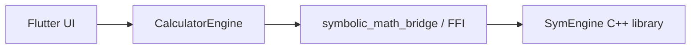

# CrispCalc — CAS Calculator

A cross-platform scientific and graphing calculator built with Flutter. It
features an adaptive UI (mobile bottom-nav / desktop side-rail / wide-screen
split-view) and is powered by the SymEngine Computer Algebra System for
symbolic math.

Status: work in progress. It at least showcases how to set up a CAS wrapper
from Flutter to C++ and how to interact with Flutter's irksome TextField.

## Core Features

- **LaTeX display:** Textbook-style rendering of expressions and history via
  `flutter_math_fork`. Inline LaTeX input with live preview, 12-stage
  LaTeX→engine converter.
- **Symbolic CAS engine:** Algebra and calculus operations, not just numerical
  calculations.
  - Solver: `solve(x^2 - 4, x)` returns `x = {-2, 2}`.
  - Calculus: symbolic differentiation (`d/dx`), symbolic limits (Gruntz-style
    growth-rate analysis at infinity).
  - Algebraic: `factor` (univariate + multivariate via FLINT), `expand`,
    `simplify` (rational cancellation), `gcd`, `lcm`.
  - Numerics: `factorial`, `fibonacci`, constants `π`, `e`, `γ`.
  - Matrix: `det`, `inv`, `transpose`, `rref`, `eigenvalues`, `eigenvectors`
    (pure-Dart QR algorithm with Hessenberg reduction).
- **Interactive graphing:** Y1..Y10 function slots, pan + pinch-to-zoom, axis
  labelling, curve sketching (Kurvendiskussion), root & extrema annotations,
  parameter sliders.
- **Notepad:** Multi-line evaluator with variables, cross-references,
  subtotals, date/time arithmetic, currency conversion (44 currencies),
  inline mini-plots, collapsible sections, templates, Markdown/LaTeX export.
- **Statistics:** Descriptive stats, linear/polynomial/exponential regression,
  normal/binomial distributions, 9 hypothesis tests (t-test, ANOVA,
  chi-square, Fisher's exact, sign test, Wilcoxon). Clipboard paste for data.
- **Unit conversion:** 6 base dimensions + 5 derived SI units (N, J, W, Pa, Hz),
  composite-dimension arithmetic (`100 m / 10 s → 10 m/s`), SI prefix system.
- **Constraint solver:** FlatZinc parser + solver (Sudoku, N-queens, boolean
  SAT). Notepad `fzn:` prefix for inline constraint problems.
- **CrispAssist:** AI verifier (never solver) via streaming SSE. Anthropic +
  OpenAI compatible. Explain/Narrate/Translate actions.
- **Math OCR:** On-device DeiT+TrOCR (printed) + HMER/BTTR (handwritten) via
  CrispEmbed ggml FFI. Cloud LLM fallback (Claude/GPT-4V). Camera + pen input.
- **Adaptive layout:**
  - `< 720 px` — bottom navigation bar (mobile).
  - `720–1199 px` — side rail (tablets / narrow desktop windows).
  - `≥ 1200 px` — side rail plus a secondary pane so calculator + graph (or
    calculator + analysis) can be shown at the same time.
- **Accessibility:** High-contrast theme, configurable text scale (80%–150%),
  keyboard navigation (Ctrl+1-6), ~225 semantic labels, full keyboard input.
- **Localization:** English, German, French, Spanish (EN/DE/FR/ES) with
  complete function reference translations.
- **Export/Import:** PDF, Markdown, LaTeX, JSON (full state), CSV (history).
  Shareable URL links (`?expr=...&tab=N`).

## Architecture

Three layers:

1. **Flutter UI** (`lib/screens`, `lib/widgets`) — renders the keypad,
   captures input, displays results. No knowledge of FFI.
2. **`CalculatorEngine`** (`lib/engine/calculator_engine.dart`) — Dart facade
   over the `symbolic_math_bridge` plugin. Every method returns a `String` so
   the UI can treat errors and successes the same way. When the native bridge
   isn't loaded (e.g. under `flutter test` on the host), every method returns
   `'Error: <op> requires native library'` instead of crashing.
3. **`symbolic_math_bridge`** (separate package) — Flutter FFI plugin that
   wraps the SymEngine C API.



## Project layout

```
CrispCalc/
├── lib/
│   ├── main.dart                       # App entry, adaptive shell, settings
│   ├── controllers/
│   │   └── latex_controller.dart       # Cursor-aware LaTeX text controller
│   ├── engine/
│   │   ├── app_state.dart              # Singleton: history, variables, fns
│   │   ├── calculator_engine.dart      # Bridge facade
│   │   ├── analysis_engine.dart        # Curve sketching pipeline
│   │   ├── eigen.dart                  # Eigenvalue/eigenvector (QR algorithm)
│   │   ├── matrix_evaluator.dart       # Matrix ops (det/inv/rref/eigen)
│   │   ├── statistics.dart             # Descriptive stats + regression
│   │   ├── unit_expression.dart        # Unit arithmetic + SI derived
│   │   ├── notepad_evaluator.dart      # Multi-line notepad pipeline
│   │   └── symbolic_limit.dart         # Gruntz-style limit engine
│   ├── localization/
│   │   └── app_localizations.dart      # i18n strings (en/de/fr/es)
│   ├── screens/
│   │   ├── calculator_screen.dart      # Calc keypad + display
│   │   ├── graphing_screen.dart        # Plotter
│   │   ├── function_editor_screen.dart # Y= editor
│   │   ├── analysis_hub_screen.dart    # Module picker
│   │   ├── curve_analysis_input_screen.dart
│   │   ├── curve_analysis_results_screen.dart
│   │   └── matrix_editor_screen.dart
│   ├── utils/
│   │   ├── expression_preprocessing_utils.dart  # Implicit-* / mod / Y(x) inlining
│   │   ├── latex_conversion_utils.dart          # LaTeX <-> engine syntax
│   │   ├── math_display_utils.dart              # Result formatting
│   │   └── keyboard_input_handler.dart          # Hardware-keyboard mapping
│   └── widgets/
│       ├── calculator_keypad.dart      # Tabbed keypad
│       ├── calculator_button.dart      # Single key
│       ├── keypad_grid.dart            # Layout grid
│       ├── latex_input_field.dart      # Live LaTeX-rendered input
│       ├── function_picker_dialogs.dart
│       ├── memory_dialogs.dart
│       ├── progress_overlay.dart
│       ├── variable_viewer.dart
│       └── calculator_display.dart
├── test/                               # Unit tests (no native bridge needed)
├── PLAN.md                             # Open work items
├── HISTORY.md                          # Completed work log
└── pubspec.yaml
```

## Building and running

```bash
flutter pub get
flutter test            # ~3820 unit tests run without the native bridge
flutter run             # Runs the app; SymEngine bridge required for math

# CAS regression corpus (SymPy-certified expected values):
python3 tool/cas_corpus_verify.py                        # certify + regenerate
flutter test test/cas_corpus_test.dart                   # pure-Dart fallbacks
flutter test integration_test/cas_corpus_native_test.dart -d macos  # native
```

The native side lives in the `symbolic_math_bridge` plugin (separate
repository, git-pinned in `pubspec.yaml`). See its README for the SymEngine
build.

## Platform support (v0.4.1)

| Platform | SymEngine bridge | Notes |
|---|---|---|
| **iOS** | ✓ full | `.xcframework` from `math-stack-ios-builder` |
| **macOS** | ✓ full | `.xcframework` from `math-stack-ios-builder` |
| **Android arm64-v8a** | ✓ full | `libsymbolic_math_bridge.so`, vcpkg+NDK build (PLAN P11 R132) |
| **Windows x86_64** | ✓ full | `symbolic_math_bridge_plugin.dll`, MSYS2/MinGW64 build (PLAN P11 R131) |
| **Linux x86_64** | ✓ full | `libsymbolic_math_bridge.so`, vcpkg `x64-linux` static build on ubuntu-22.04 / GLIBC 2.35 (PLAN P11 R130) |
| Android x86_64 / armeabi-v7a | ✗ not built | extend the bridge's build matrix when needed |
| **Web** (Vercel) | ✓ CAS via WASM | **Live: https://crisp-calc.vercel.app** (PLAN P10 Path B). Full CAS core (evaluate, expand, diff, solve, substitute, trig, gcd/lcm/factorial/fibonacci, matrices) runs via SymEngine WASM (1.1 MB, `INTEGER_CLASS=boostmp`). Pure-Dart CAS interim (expand/diff/solve for single-variable polynomials) serves as synchronous pre-load fallback. MPFR precision / FLINT number-theory / Bessel not available in web build. |

Releases ship platform binaries via GitHub Actions; see GH Releases
for `crisp_calc-vX.Y.Z-{macos.zip,ios-unsigned.zip,linux-x64.tar.gz,
windows-x64.zip,android.apk}`.

## Math OCR (June 2026)

On-device math equation recognition via CrispEmbed's ggml inference:
- **Printed math:** DeiT encoder + TrOCR decoder — image → LaTeX in 3.3s (FP16)
  - 4 quantization levels: F32 (112MB), F16 (56MB), Q8_0 (31MB), Q4_K (17MB)
  - Models on HuggingFace: [`cstr/pix2tex-mfr-gguf`](https://huggingface.co/cstr/pix2tex-mfr-gguf)
- **Handwritten math:** HMER (DenseNet+GRU, 13MB) and BTTR (DenseNet+Transformer, 4–25MB)
  - Model type auto-detected from GGUF by unified `CrispEmbedOcr` FFI
- **Cloud fallback:** CloudLlmOcrProvider (Claude/GPT-4V) for cross-platform coverage
- **Pen input:** DrawingCanvas on all platforms (mouse/touch/stylus) → OCR pipeline
- Camera or pen tap on Calculator/Notepad → photo/drawing → LaTeX → engine syntax
- No cloud required, no Python, no ONNX at runtime — pure C++ via FFI

## Known limitations

- `limit()` uses a pure-Dart symbolic engine (L'Hôpital + Gruntz growth-rate
  analysis) — no native SymEngine binding yet.
- Matrix eigenvalues/eigenvectors use a pure-Dart QR algorithm — works well
  for small matrices (tested up to 4x4), but not optimized for large ones.
- `simplify()` handles the core trig identities natively since bridge
  1.4.1 (Pythagorean, double angle, power reduction, secant form); broader
  identity rewriting (angle sums, half angles, radicals) is still open.
- OCR requires the CrispEmbed native library bundled per platform.
- Multivariate `factor()` uses FLINT and is not available in the web build
  (WASM `fmpz_mpoly_factor` traps).

See `PLAN.md` for the current punch list and `HISTORY.md` for what landed
recently.
